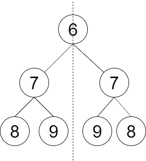

# 二叉树是否为镜像

## 题目

请设计一个函数判断一棵二叉树是否 **轴对称** 。（镜像）

**示例 1：**



```
输入：root = [6,7,7,8,9,9,8]
输出：true
解释：从图中可看出树是轴对称的。
```


## 解题思路

前序遍历

## 代码

```java
class Solution {
    public boolean checkSymmetricTree(TreeNode root) {
         return check(root, root);

    }
      private boolean check(TreeNode p, TreeNode q) {
        if (p == null && q == null) {
            return true;
        }
        if (p == null || q == null) {
            return false;
        }
        return p.val == q.val && check(p.left, q.right) && check(p.right, q.left);
    }
}
```

