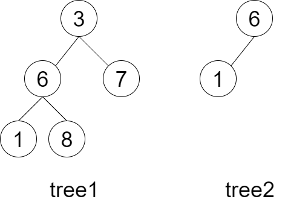

# 子结构判断


## 题目描述

给定两棵二叉树 `tree1` 和 `tree2`，判断 `tree2` 是否以 `tree1` 的某个节点为根的子树具有 **相同的结构和节点值** 。
注意，**空树** 不会是以 `tree1` 的某个节点为根的子树具有 **相同的结构和节点值** 。

 

**示例 1：**

 


 

```
输入：tree1 = [1,7,5], tree2 = [6,1]
输出：false
解释：tree2 与 tree1 的一个子树没有相同的结构和节点值。
```

**示例 2：**



```
输入：tree1 = [3,6,7,1,8], tree2 = [6,1]
输出：true
解释：tree2 与 tree1 的一个子树拥有相同的结构和节点值。即 6 - > 1。
```

 

**提示：**

```
0 <= 节点个数 <= 10000
```


## 解题思路


## 代码

```java
public class 子结构判断 {
    public boolean isSubStructure(TreeNode A, TreeNode B) {
        if (A == null || B == null) {
            return false;
        }
        return fun(A, B) ||
                isSubStructure(A.left, B) ||
                isSubStructure(A.right, B);

    }

    public boolean fun(TreeNode a, TreeNode b) {
        if (b == null) {
            return true;
        }
        if (a == null) {
            return false;
        }
        return (a.val == b.val) &&
                fun(a.left, b.left) &&
                fun(a.right, b.right);
    }
}
```

