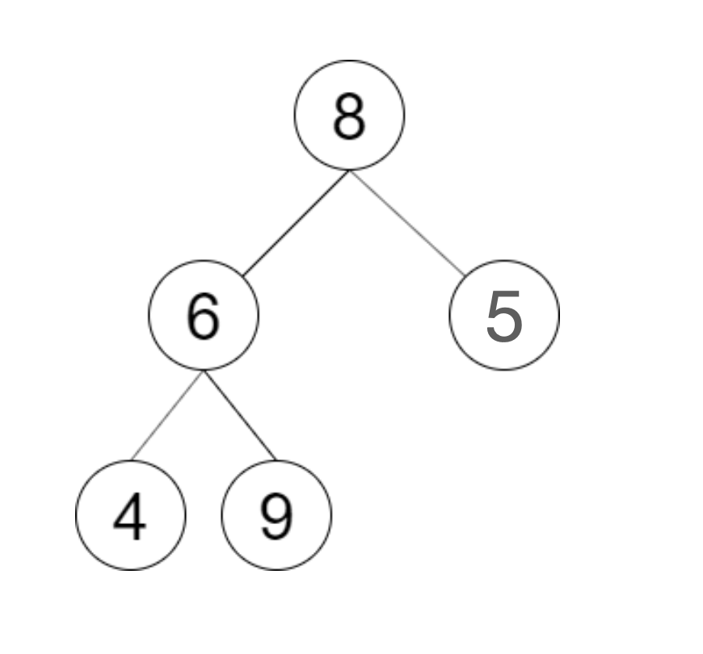
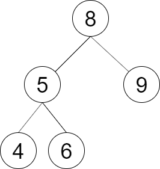
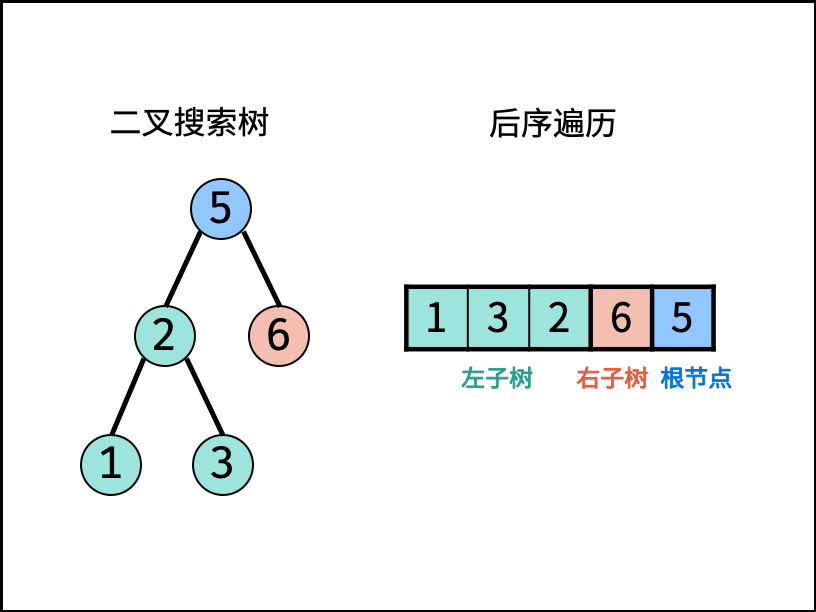

# 验证二叉搜索树的后序遍历序列


## 题目描述

请实现一个函数来判断整数数组 `postorder` 是否为二叉搜索树的后序遍历结果。

 

**示例 1：**



```
输入: postorder = [4,9,6,5,8]
输出: false 
解释：从上图可以看出这不是一颗二叉搜索树
```

**示例 2：**



```
输入: postorder = [4,6,5,9,8]
输出: true 
解释：可构建的二叉搜索树如上图
```

 

**提示：**

- `数组长度 <= 1000`
- `postorder` 中无重复数字


## 解题思路

**后序遍历定义： [ 左子树 | 右子树 | 根节点 ] ，即遍历顺序为 “左、右、根” 。**

**二叉搜索树定义：** 左子树中所有节点的值 < 根节点的值；右子树中所有节点的值 > 根节点的值；其左、右子树也分别为二叉搜索树。




## 代码

```java
public class 验证二叉搜索树的后序遍历序列 {
    public boolean verifyPostorder(int[] postorder) {
        return recur(postorder, 0, postorder.length - 1);
    }

    boolean recur(int[] postorder, int i, int j) {
        if (i >= j) {
            return true;
        }
        /**
         * 从 i 开始，寻找第一个大于 postorder[j] 的元素位置 p，这个元素将标记左子树和右子树的分界点。
         * postorder[i] 到 postorder[p-1] 都是左子树节点，它们的值都小于当前根节点 postorder[j]。
         */
        int p = i;
        while (postorder[p] < postorder[j]) {
            p++;
        }
        /**
         * 继续从 m 开始检查是否所有元素都大于 postorder[j]。如果 postorder[p] 中存在小于等于 postorder[j] 的值，
         * 说明不满足 BST 的右子树特性。
         */
        int m = p;
        while (postorder[p] > postorder[j]) {
            p++;
        }
        /**
         * 第一个大于根节点的节点，索引记为 m
         * p=j:判断此树是否正确。
         * recur(i, m - 1)recur(i,m−1) ： 判断 此树的左子树 是否正确。
         * recur(m, j - 1)recur(m,j−1) ： 判断 此树的右子树 是否正确。
         */
        return p == j &&
                recur(postorder, i, m - 1) &&
                recur(postorder, m, j - 1);
    }
}
```


