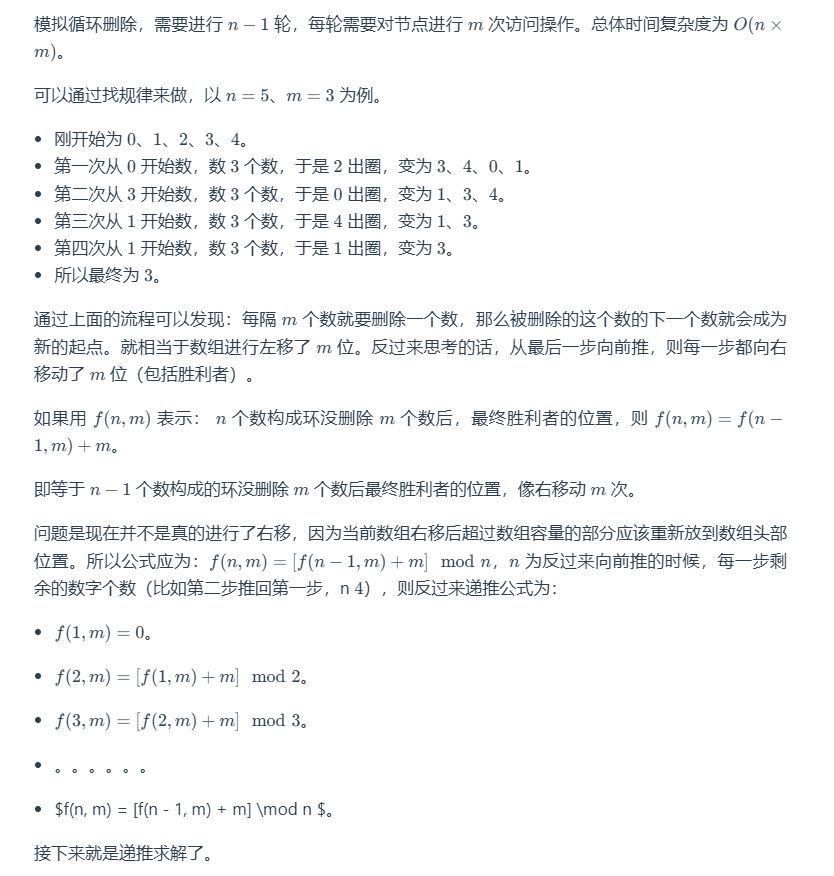

# 圆圈中最后剩下的数字


## 题目描述

**描述**：0、1、…、n−1 这 n 个数字排成一个圆圈，从数字 0 开始，每次从圆圈里删除第 m*个数字。现在给定整数 n* 和 m。

## 解题思路

**思路 1：枚举 + 模拟**



## 代码

```java
public class 圆圈中最后剩下的数字 {
    public int lastRemaining(int n, int m) {
        int ans = 0;
        // 最后一轮剩下2个人，所以从2开始反推
        for (int i = 2; i <= n; i++) {
            ans = (ans + m) % i;
        }
        return ans;
    }
}
```

