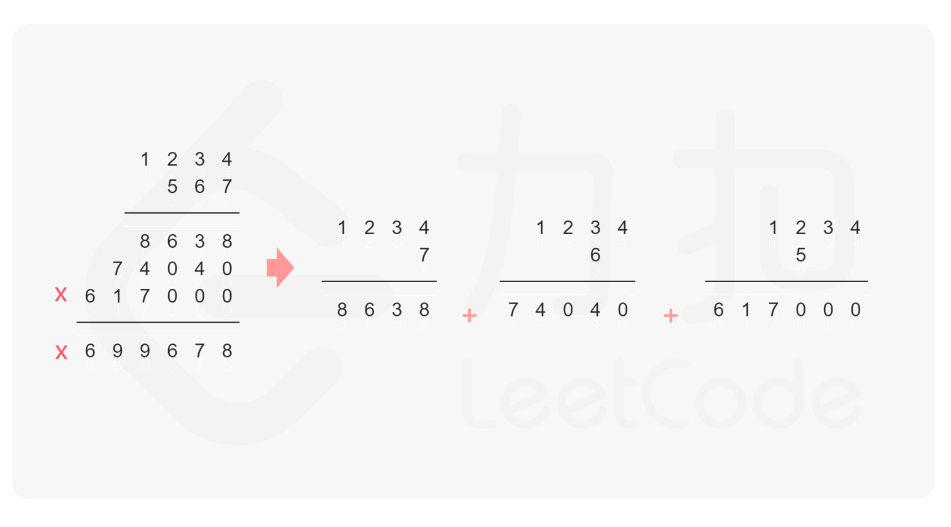

# 字符串相乘


## 题目描述

给定两个以字符串形式表示的非负整数 `num1` 和 `num2`，返回 `num1` 和 `num2` 的乘积，它们的乘积也表示为字符串形式。

**注意：**不能使用任何内置的 BigInteger 库或直接将输入转换为整数。

 

**示例 1:**

```
输入: num1 = "2", num2 = "3"
输出: "6"
```

**示例 2:**

```
输入: num1 = "123", num2 = "456"
输出: "56088"
```

 

**提示：**

- `1 <= num1.length, num2.length <= 200`
- `num1` 和 `num2` 只能由数字组成。
- `num1` 和 `num2` 都不包含任何前导零，除了数字0本身。

## 解题思路

```
num1 的第 i 位乘上 num2 的第 j 位，结果会分别对应 pos 的第 i + j 位和第 i + j + 1 位
时间复杂度：O（m * n）。m，n 是两个字符串的长度
空间复杂度：O（m + n）。m，n 是两个字符串的长度
```



## 代码

```java
/**
 * num1 的第 i 位乘上 num2 的第 j 位，结果会分别对应 pos 的第 i + j 位和第 i + j + 1 位
 * 时间复杂度：O（m * n）。m，n 是两个字符串的长度
 * 空间复杂度：O（m + n）。m，n 是两个字符串的长度
 */
public class 字符串相乘 {
    public String multiply(String num1, String num2) {
        if (num1.equals("0") || num2.equals("0")) {
            return "0";
        }
        int n1 = num1.length();
        int n2 = num2.length();
        int[] pos = new int[n1 + n2]; //保存最后的结果
        for (int i = n1 - 1; i >= 0; i--) {
            for (int j = n2 - 1; j >= 0; j--) {
                //相乘的结果
                int mul = (num1.charAt(i) - '0') * (num2.charAt(j) - '0');
                //加上 pos[i+j+1] 之前已经累加的结果
                int sum = mul + pos[i + j + 1];
                //更新 pos[i + j]
                pos[i + j] += sum / 10;
                //更新 pos[i + j + 1]
                pos[i + j + 1] = sum % 10;
            }
        }
        StringBuilder sb = new StringBuilder();
        for (int i = 0; i < pos.length; i++) {
            //判断最高位是不是 0 
            if (i == 0 && pos[i] == 0) {
                continue;
            }
            sb.append(pos[i]);
        }
        return sb.toString();
    }
}
```

