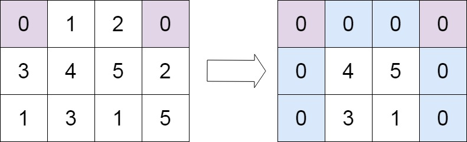

# 矩阵置零

## 题目描述

给定一个 *m* x *n* 的矩阵，如果一个元素为 **0** ，则将其所在行和列的所有元素都设为 **0** 。请使用 **[原地](http://baike.baidu.com/item/原地算法)** 算法**。**

 

**示例 1：**


```
输入：matrix = [[1,1,1],[1,0,1],[1,1,1]]
输出：[[1,0,1],[0,0,0],[1,0,1]]
```

**示例 2：**



```
输入：matrix = [[0,1,2,0],[3,4,5,2],[1,3,1,5]]
输出：[[0,0,0,0],[0,4,5,0],[0,3,1,0]]
```

 

**提示：**

- `m == matrix.length`
- `n == matrix[0].length`
- `1 <= m, n <= 200`
- `-231 <= matrix[i][j] <= 231 - 1`

 

**进阶：**

- 一个直观的解决方案是使用  O(*mn*) 的额外空间，但这并不是一个好的解决方案。
- 一个简单的改进方案是使用 O(*m* + *n*)的额外空间，但这仍然不是最好的解决方案。
- 你能想出一个仅使用常量空间的解决方案吗？

## 解题思路

最简单的方式使用HashSet。

## 代码

```java
public class 矩阵置零 {
    public void setZeroes(int[][] matrix) {
        int R = matrix.length;
        int C = matrix[0].length;
        Set<Integer> rows = new HashSet<Integer>();
        Set<Integer> cols = new HashSet<Integer>();

        // Essentially, we mark the rows and columns that are to be made zero
        for (int i = 0; i < R; i++) {
            for (int j = 0; j < C; j++) {
                if (matrix[i][j] == 0) {
                    rows.add(i);
                    cols.add(j);
                }
            }
        }

        for (int i = 0; i < R; i++) {
            for (int j = 0; j < C; j++) {
                if (rows.contains(i) || cols.contains(j)) {
                    matrix[i][j] = 0;
                }
            }
        }
    }
}
```


