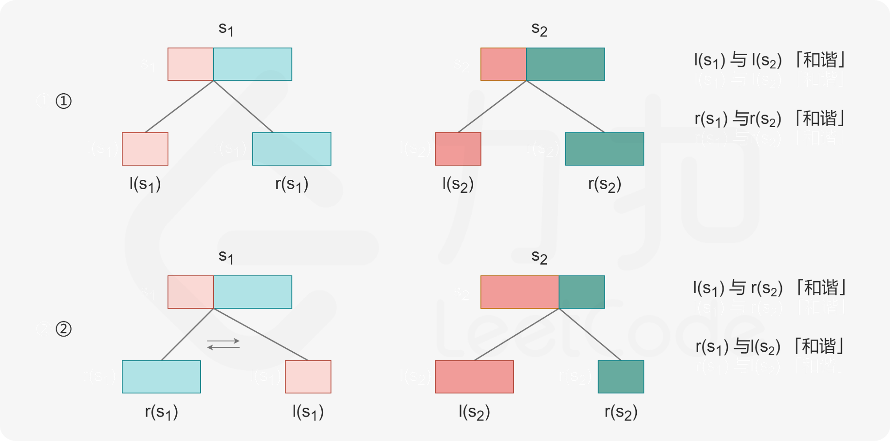

# 扰乱字符串

## 题目

使用下面描述的算法可以扰乱字符串 `s` 得到字符串 `t` ：

1. 如果字符串的长度为 1 ，算法停止
2. 如果字符串的长度 > 1 ，执行下述步骤：
   - 在一个随机下标处将字符串分割成两个非空的子字符串。即，如果已知字符串 `s` ，则可以将其分成两个子字符串 `x` 和 `y` ，且满足 `s = x + y` 。
   - **随机** 决定是要「交换两个子字符串」还是要「保持这两个子字符串的顺序不变」。即，在执行这一步骤之后，`s` 可能是 `s = x + y` 或者 `s = y + x` 。
   - 在 `x` 和 `y` 这两个子字符串上继续从步骤 1 开始递归执行此算法。

给你两个 **长度相等** 的字符串 `s1` 和 `s2`，判断 `s2` 是否是 `s1` 的扰乱字符串。如果是，返回 `true` ；否则，返回 `false` 。

**示例 1：**

```
输入：s1 = "great", s2 = "rgeat"
输出：true
解释：s1 上可能发生的一种情形是：
"great" --> "gr/eat" // 在一个随机下标处分割得到两个子字符串
"gr/eat" --> "gr/eat" // 随机决定：「保持这两个子字符串的顺序不变」
"gr/eat" --> "g/r / e/at" // 在子字符串上递归执行此算法。两个子字符串分别在随机下标处进行一轮分割
"g/r / e/at" --> "r/g / e/at" // 随机决定：第一组「交换两个子字符串」，第二组「保持这两个子字符串的顺序不变」
"r/g / e/at" --> "r/g / e/ a/t" // 继续递归执行此算法，将 "at" 分割得到 "a/t"
"r/g / e/ a/t" --> "r/g / e/ a/t" // 随机决定：「保持这两个子字符串的顺序不变」
算法终止，结果字符串和 s2 相同，都是 "rgeat"
这是一种能够扰乱 s1 得到 s2 的情形，可以认为 s2 是 s1 的扰乱字符串，返回 true
```

**示例 2：**

```
输入：s1 = "abcde", s2 = "caebd"
输出：false
```

**示例 3：**

```
输入：s1 = "a", s2 = "a"
输出：true
```

 

**提示：**

- `s1.length == s2.length`
- `1 <= s1.length <= 30`
- `s1` 和 `s2` 由小写英文字母组成


## 解题思路

#### 方法一：动态规划

**思路与算法**

显然「扰乱字符串」的关系是具有对称性的，即如果 $s_1$ 是 $s_2$ 的扰乱字符串，那么 $s_2$ 也是 $s_1$ 的扰乱字符串。为了叙述方便，我们称这种情况下，$s_1$ 和 $s_2$ 是「和谐」的。

那么如何判断 $s_1$ 和 $s_2$ 是否「和谐」呢？我们首先可以想到几个简单的判断方法：

- 如果 $s_1 = s_2$，那么它们是「和谐」的；
- 如果 $s_1$ 和 $s_2$ 的长度不同，那么它们一定不是「和谐」的；
- 如果 $s_1$ 中某个字符 $c$ 出现了 $x_1$ 次，而 $c$ 在 $s_2$ 中出现了 $x_2$ 次，且 $x_1 \ne x_2$，那么它们一定不是「和谐」的。这是因为任意操作都不会改变一个字符串中的字符种类以及数量。

那么对于剩下的情况，我们该如何判断呢？我们可以从 $s_1$ 的分割方法入手。假设 $s_1$ 作为根节点时被分割成了 $l(s_1)$ 以及 $r(s_1)$ 两个子串，那么：

- 如果 $l(s_1)$ 和 $r(s_1)$ 没有被交换，那么 $s_2$ 需要存在一种分割方法 $s_2 = l(s_2) + r(s_2)$，使得 $l(s_1)$ 和 $l(s_2)$ 是「和谐」的，并且 $r(s_1)$ 和 $r(s_2)$ 也是「和谐」的；
- 如果 $l(s_1)$ 和 $r(s_1)$ 被交换了，那么 $s_2$ 需要存在一种分割方法 $s_2 = l(s_2) + r(s_2)$，使得 $l(s_1)$ 和 $r(s_2)$ 是「和谐」的，并且 $r(s_1)$ 和 $l(s_2)$​ 也是「和谐」的。



这样一来，我们就把原本需要解决的问题划分成了两个本质相同，但规模更小的子问题，因此可以考虑使用动态规划解决。

设 $f(s_1, s_2)$ 表示 $s_1$ 和 $s_2$ 是否「和谐」，那么我们可以写出状态转移方程：

$$
f(s_1, s_2) =
\begin{cases}
\text{True}, & \text{如果 } s_1 = s_2 \\\\
\text{False}, & \text{如果存在某个字符 } c \text{，它在 } s_1 \text{ 和 } s_2 \text{ 中的出现次数不同}
\end{cases}
$$
因为题目保证给定的原始字符串的长度相同，因此我们只需要判断上面的两种情况。

如果 $s_1$ 和 $s_2$ 不符合这两种情况，那么我们需要**枚举分割点**，进一步递归判断它们是否满足「和谐」的条件。


## 代码

```java
class Solution {
    // 记忆化搜索存储状态的数组
    // -1 表示 false，1 表示 true，0 表示未计算
    int[][][] memo;
    String s1, s2;

    public boolean isScramble(String s1, String s2) {
        int length = s1.length();
        this.memo = new int[length][length][length + 1];
        this.s1 = s1;
        this.s2 = s2;
        return dfs(0, 0, length);
    }

    // 第一个字符串从 i1 开始，第二个字符串从 i2 开始，子串的长度为 length，是否和谐
    public boolean dfs(int i1, int i2, int length) {
        if (memo[i1][i2][length] != 0) {
            return memo[i1][i2][length] == 1;
        }

        // 判断两个子串是否相等
        if (s1.substring(i1, i1 + length).equals(s2.substring(i2, i2 + length))) {
            memo[i1][i2][length] = 1;
            return true;
        }

        // 判断是否存在字符 c 在两个子串中出现的次数不同
        if (!checkIfSimilar(i1, i2, length)) {
            memo[i1][i2][length] = -1;
            return false;
        }
        
        // 枚举分割位置
        for (int i = 1; i < length; ++i) {
            // 不交换的情况
            if (dfs(i1, i2, i) && dfs(i1 + i, i2 + i, length - i)) {
                memo[i1][i2][length] = 1;
                return true;
            }
            // 交换的情况
            if (dfs(i1, i2 + length - i, i) && dfs(i1 + i, i2, length - i)) {
                memo[i1][i2][length] = 1;
                return true;
            }
        }

        memo[i1][i2][length] = -1;
        return false;
    }

    public boolean checkIfSimilar(int i1, int i2, int length) {
        Map<Character, Integer> freq = new HashMap<Character, Integer>();
        for (int i = i1; i < i1 + length; ++i) {
            char c = s1.charAt(i);
            freq.put(c, freq.getOrDefault(c, 0) + 1);
        }
        for (int i = i2; i < i2 + length; ++i) {
            char c = s2.charAt(i);
            freq.put(c, freq.getOrDefault(c, 0) - 1);
        }
        for (Map.Entry<Character, Integer> entry : freq.entrySet()) {
            int value = entry.getValue();
            if (value != 0) {
                return false;
            }
        }
        return true;
    }
}
```


