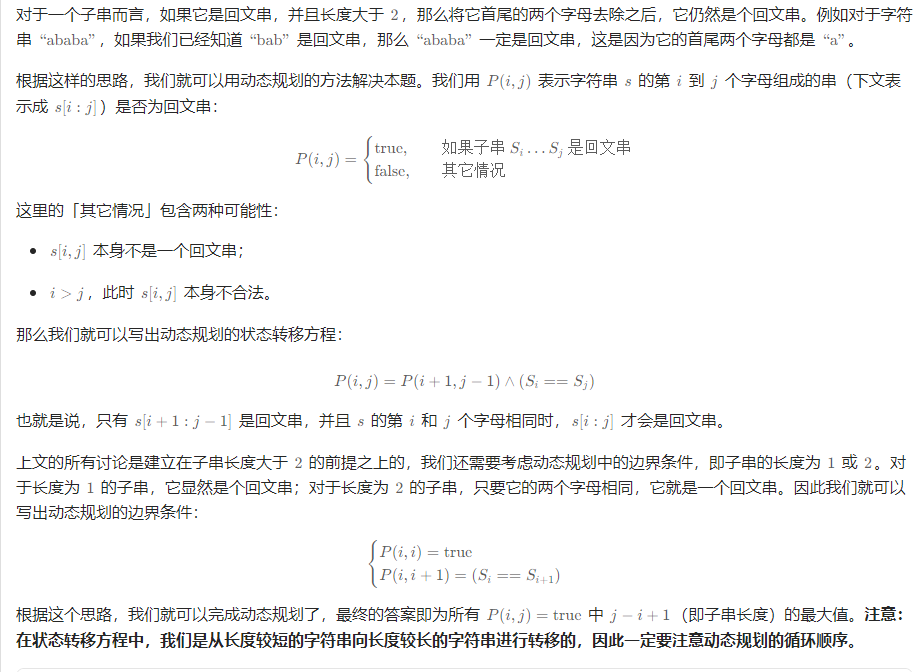
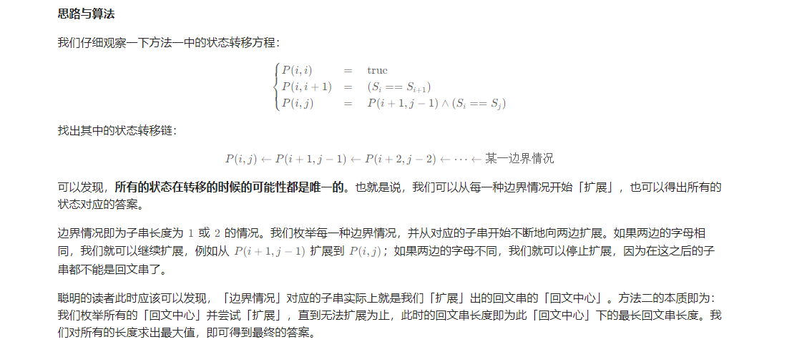

# 最长回文子串

## 题目

给你一个字符串 `s`，找到 `s` 中最长的 回文子串。

**示例 1：**

```
输入：s = "babad"
输出："bab"
解释："aba" 同样是符合题意的答案。
```

**示例 2：**

```
输入：s = "cbbd"
输出："bb"
```

 

**提示：**

- `1 <= s.length <= 1000`
- `s` 仅由数字和英文字母组成


## 解题思路

### 方法一：动态规划



**复杂度分析**

- 时间复杂度：*O*(*n*2)，其中 *n* 是字符串的长度。动态规划的状态总数为 *O*(*n*2)，对于每个状态，我们需要转移的时间为 *O*(1)。

- 空间复杂度：*O*(*n*2)，即存储动态规划状态需要的空间。

  

### 方法二：中心扩展算法



**复杂度分析**

- 时间复杂度：*O*(*n*2)，其中 *n* 是字符串的长度。长度为 1 和 2 的回文中心分别有 *n* 和 *n*−1 个，每个回文中心最多会向外扩展 *O*(*n*) 次。
- 空间复杂度：*O*(1)。

## 代码

```java
public class Solution {

    public String longestPalindrome(String s) {
        int len = s.length();
        if (len < 2) {
            return s;
        }

        int maxLen = 1;
        int begin = 0;
        // dp[i][j] 表示 s[i..j] 是否是回文串
        boolean[][] dp = new boolean[len][len];
        // 初始化：所有长度为 1 的子串都是回文串
        for (int i = 0; i < len; i++) {
            dp[i][i] = true;
        }

        char[] charArray = s.toCharArray();
        // 递推开始
        // 先枚举子串长度
        for (int L = 2; L <= len; L++) {
            // 枚举左边界，左边界的上限设置可以宽松一些
            for (int i = 0; i < len; i++) {
                // 由 L 和 i 可以确定右边界，即 j - i + 1 = L 得
                int j = L + i - 1;
                // 如果右边界越界，就可以退出当前循环
                if (j >= len) {
                    break;
                }

                if (charArray[i] != charArray[j]) {
                    dp[i][j] = false;
                } else {
                    if (j - i < 3) {
                        dp[i][j] = true;
                    } else {
                        dp[i][j] = dp[i + 1][j - 1];
                    }
                }

                // 只要 dp[i][L] == true 成立，就表示子串 s[i..L] 是回文，此时记录回文长度和起始位置
                if (dp[i][j] && j - i + 1 > maxLen) {
                    maxLen = j - i + 1;
                    begin = i;
                }
            }
        }
        return s.substring(begin, begin + maxLen);
    }
}
```

