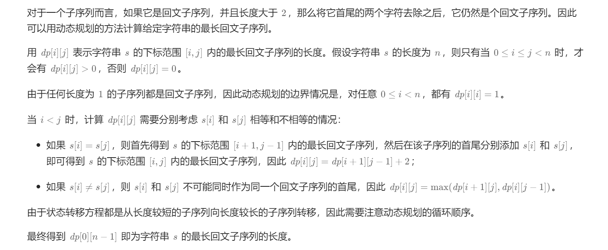

# 最长回文子序列

## 题目

给你一个字符串 `s` ，找出其中最长的回文子序列，并返回该序列的长度。

子序列定义为：不改变剩余字符顺序的情况下，删除某些字符或者不删除任何字符形成的一个序列。

 

**示例 1：**

```
输入：s = "bbbab"
输出：4
解释：一个可能的最长回文子序列为 "bbbb" 。
```

**示例 2：**

```
输入：s = "cbbd"
输出：2
解释：一个可能的最长回文子序列为 "bb" 。
```

 

**提示：**

- `1 <= s.length <= 1000`
- `s` 仅由小写英文字母组成

## 解题思路



其实和正常的没有什么区别：只是这个是从左到右，从上到下的顺序。


## 代码

```java
class Solution {
    public int longestPalindromeSubseq(String s) {
        int n = s.length();
        int[][] dp = new int[n][n];
        for (int i = n - 1; i >= 0; i--) {
            dp[i][i] = 1;
            char c1 = s.charAt(i);
            for (int j = i + 1; j < n; j++) {
                char c2 = s.charAt(j);
                if (c1 == c2) {
                    dp[i][j] = dp[i + 1][j - 1] + 2;
                } else {
                    dp[i][j] = Math.max(dp[i + 1][j], dp[i][j - 1]);
                }
            }
        }
        return dp[0][n - 1];
    }
}
```

