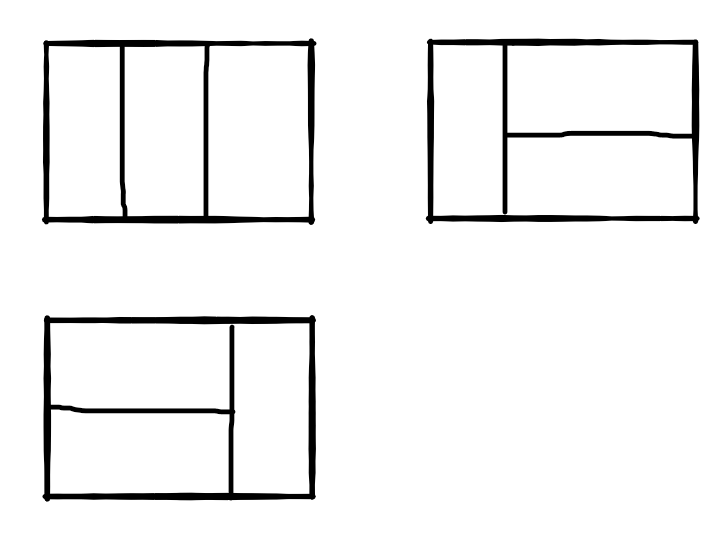

# 矩形覆盖


## 题目描述

我们可以用` 2*1 `的小矩形横着或者竖着去覆盖更大的矩形。请问用 n 个 `2*1 `的小矩形无重叠地覆盖一个 `2*n `的大矩形，从同一个方向看总共有多少种不同的方法？

数据范围：0≤n≤38 
进阶：空间复杂度 O(1) ，时间复杂度 O(n)

注意：约定 n == 0 时，输出 0

比如n=3时，`2*3`的矩形块有3种不同的覆盖方法(从同一个方向看)：




## 解题思路

**状态转移方程是：**
$$
dp[n]=dp[n−1]+dp[n−2]
$$

- `dpi_2` 表示 `dp[i-2]`，即覆盖 `2*(i-2)` 矩形的方法数。
- `dpi_1` 表示 `dp[i-1]`，即覆盖 `2*(i-1)` 矩形的方法数。
- `res` 表示当前的结果 `dp[i]`，它是 `dpi_1 + dpi_2` 的和。


## 代码

```java
public class 矩形覆盖 {
    public int rectCover(int target) {
        if (target <= 2)
            return target;
        int dpi_2 = 1;
        int dpi_1 = 2;
        int res = 0;
        for (int i = 3; i <= target; i++) {
            res = dpi_1 + dpi_2;
            dpi_2 = dpi_1;
            dpi_1 = res;
        }
        return res;
    }
}
```


