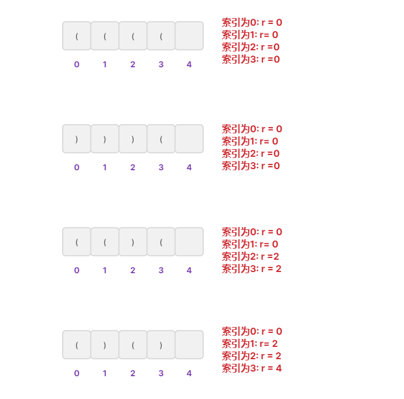

# 最长有效括号

## 题目

给你一个只包含 `'('` 和 `')'` 的字符串，找出最长有效（格式正确且连续）括号子串的长度。

**示例 1：**

```
输入：s = "(()"
输出：2
解释：最长有效括号子串是 "()"
```

**示例 2：**

```
输入：s = ")()())"
输出：4
解释：最长有效括号子串是 "()()"
```

**示例 3：**

```
输入：s = ""
输出：0
```


**提示：**

- `0 <= s.length <= 3 * 104`
- `s[i]` 为 `'('` 或 `')'`


## 解题思路

提到括号匹配，第一时间能让人想到的就是利用栈。这里需要计算嵌套括号的总长度，所以栈里面不能单纯的存左括号，而应该存左括号在原字符串的下标，这样通过下标相减可以获取长度。



**问题1：什么时候进行下标相减获取长度呢？**

肯定是遇到的每个 `')'`的时候，先弹出栈顶元素表示匹配了当前右括号，**如果栈为空**，**说明当前的右括号为没有被匹配的右括号**，于是将其下标放入栈中来更新**上一个没有被匹配的右括号的下标**。如果栈不为空，当前右括号的下标减去栈顶元素即为以该右括号为结尾的最长有效括号的长度。

需要注意初始化时，不存在**上一个没有被匹配的右括号的下标**，那么将 `-1` 放入栈中，充当下标为 `0` 的“隔板”。

遇到`')'`就入栈。


## 代码

```java
public int longestValidParentheses(String s) {
    int n = s.length();
    int maxLength = 0;
    Stack<Integer> stack = new Stack<>();
    stack.push(-1);

    for (int i = 0; i < n; i++) {
        if (s.charAt(i) == '(') {
            stack.push(i);
        } else {
            stack.pop();
            if (stack.isEmpty()) {
                stack.push(i);
            } else {
                maxLength = Math.max(maxLength, i - stack.peek());
            }
        }
    }
    return maxLength;
}
```

