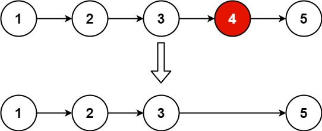

# 删除链表的倒数第N个节点


## 题目

给你一个链表，删除链表的倒数第 `n` 个结点，并且返回链表的头结点。

 

**示例 1：**



```
输入：head = [1,2,3,4,5], n = 2
输出：[1,2,3,5]
```

**示例 2：**

```
输入：head = [1], n = 1
输出：[]
```

**示例 3：**

```
输入：head = [1,2], n = 1
输出：[1]
```

 

**提示：**

- 链表中结点的数目为 `sz`
- `1 <= sz <= 30`
- `0 <= Node.val <= 100`
- `1 <= n <= sz`

## 解题思路

略

## 代码

```java
public class 删除链表的倒数第N个节点 {
    public ListNode removeNthFromEnd(ListNode head, int n) {
        int len;
        ListNode node = head;
        ListNode m = head;
        for (len = 0; m != null; len++) {
            m = m.next;
        }
        if (n < len) {
            for (int i = 1; i < len - n; i++) {
                node = node.next;
            }
            ListNode next = node.next;
            node.next = node.next.next;
            next = null;
            return head;
        } else {
            return head.next;
        }
    }
}
```

