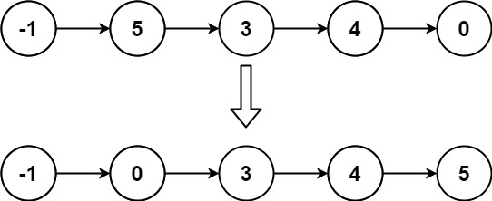

# 对链表进行插入排序


## 题目描述

给定单个链表的头 `head` ，使用 **插入排序** 对链表进行排序，并返回 *排序后链表的头* 。

**插入排序** 算法的步骤:

1. 插入排序是迭代的，每次只移动一个元素，直到所有元素可以形成一个有序的输出列表。
2. 每次迭代中，插入排序只从输入数据中移除一个待排序的元素，找到它在序列中适当的位置，并将其插入。
3. 重复直到所有输入数据插入完为止。

下面是插入排序算法的一个图形示例。部分排序的列表(黑色)最初只包含列表中的第一个元素。每次迭代时，从输入数据中删除一个元素(红色)，并就地插入已排序的列表中。

对链表进行插入排序。


 

**示例 1：**


```
输入: head = [4,2,1,3]
输出: [1,2,3,4]
```

**示例 2：**



```
输入: head = [-1,5,3,4,0]
输出: [-1,0,3,4,5]
```

 

**提示：**


- 列表中的节点数在 `[1, 5000]`范围内
- `-5000 <= Node.val <= 5000`


## 解题思路

```
和数组的插入排序思想一模一样
一个是链表一个是数组
```


## 代码

```java
public class 对链表进行插入排序 {
    public ListNode insertionSortList(ListNode head) {
        if (head == null || head.next == null) {
            return head;
        }
        ListNode newHead = new ListNode(0);//建立一个新的节点
        ListNode pointer = head;//用pointer指针表明当前剩余的待排序的链表。
        while (pointer != null) {
            ListNode temp = pointer;//取待排序链表的第一个进行排序
            pointer = pointer.next;//更新剩余未排序的链表，进行下一次的循环
            ListNode p = newHead;

            while (p.next != null && p.next.val < temp.val) {
                p = p.next;
            }
            temp.next = p.next;
            p.next = temp;

        }
        return newHead.next;
    }
}
```

